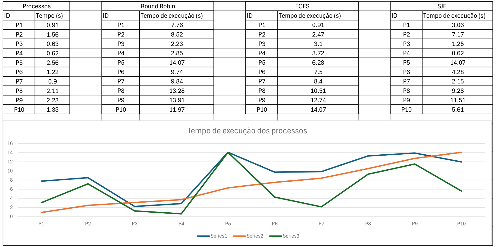

<h3 align=center>Algoritmo de Gerenciamento de Processos em C</h3>

<h6>Autores:</h6>

 * [DoctorSolo](https://github.com/DoctorSolo)
 * [Tostesx](https://github.com/Tostesx)

Para fins de estudo, fizemos algoritmos que simulem gerenciamento de processos e memoria em C.
Este projeto contem algoritmos como RoundRobin, FCFS, SJF e FBWF.

Simulamos processos nesses algoritmos e observamos quais processos levam mais e quais levam menos tempo para terminar de executar. Segue para os dados tirados:

Para mais detalhes da implementação do algoritmo FBWF, considere ler o [relatorio](Document/First-Best-Worst-Fits-Relatório.md) do algoritmo!